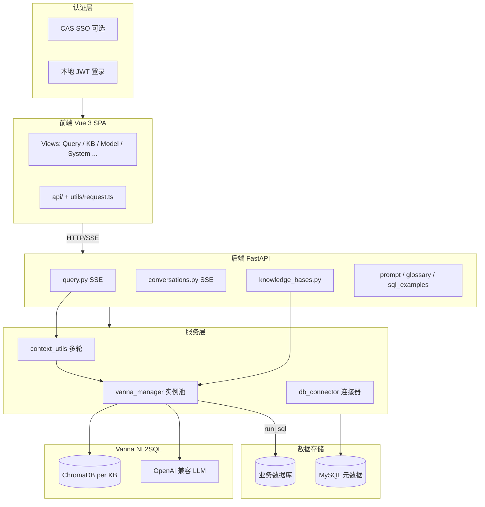

# ai-point-bi 项目架构与设计说明

---

## 一、项目概述

**ai-point-bi** 是一个企业级 **自然语言转 SQL（智能问数）** 平台。用户用中文或自然语言提问，系统通过 **Vanna** 引擎生成 SQL，在配置的业务数据库上执行，并以 **SSE 流式** 返回 SQL、表格数据、ECharts 图表及可选的 AI 分析报告。

### 核心能力

| 能力 | 说明 |
|------|------|
| 多数据源连接 | 支持 MySQL、Oracle、达梦 DM8 等；驱动层还包含 PostgreSQL、ClickHouse |
| 知识库（数据要素库） | 绑定数据源 + LLM 配置，DDL/文档/SQL 训练数据向量化至 ChromaDB |
| 自然语言查询 | 单轮查询 + 多轮对话，SSE 流式返回结果 |
| 协同优化 | 提示词模板、术语库、SQL 示例库，提升 NL2SQL 准确率 |
| 权限管理 | JWT 本地登录，RBAC 角色与知识库资源权限 |
| 运营支撑 | 查询历史、反馈记录、性能指标（部分待完善） |

### 系统截图

以下为 **AI源点 BI** 主要界面示意：

| 界面一 | 界面二 |
|:---:|:---:|
|  |  |

| 界面三 | 界面四 |
|:---:|:---:|
|  |  |

---

## 二、技术栈

### 前端

| 技术 | 版本/说明 | 用途 |
|------|-----------|------|
| Vue 3 | 3.5+ | SPA 框架 |
| TypeScript | 5.9+ | 类型安全 |
| Vite | 8.x | 构建与开发服务器 |
| Ant Design Vue | 4.x | UI 组件（青绿色 teal 主题） |
| Vue Router | 4.x | 路由与守卫 |
| Pinia | 3.x | 状态管理 |
| Axios + fetch | — | REST 请求 + SSE 流式 |
| ECharts | 6.x | 图表渲染 |
| markdown-it | 14.x | AI 报告 Markdown 渲染 |

### 后端

| 技术 | 版本/说明 | 用途 |
|------|-----------|------|
| Python | 3.10+ | 运行时 |
| FastAPI | 0.110 | 异步 REST / SSE API |
| Uvicorn | 0.29 | ASGI 服务器 |
| SQLAlchemy | 2.0 + aiomysql | 元数据库异步 ORM |
| Pydantic v2 | — | 请求/响应校验 |
| python-jose + passlib | — | JWT 认证 |
| Vanna | 0.7.4 | NL2SQL 引擎 |
| ChromaDB | 0.4.24 | 嵌入式向量库（每知识库一个 Collection） |
| OpenAI SDK | 1.14 | LLM 与 Embedding 调用 |
| loguru | — | 日志 |

### 数据存储

| 存储 | 用途 |
|------|------|
| MySQL 8 | 元数据库：用户、数据源、知识库、历史、会话、协同优化资产 |
| ChromaDB | 向量索引：DDL / 文档 / SQL 示例 |
| 业务数据库 | 查询执行目标（MySQL / Oracle / DM8 等） |
| Redis | docker-compose 中已配置，应用逻辑尚未接入 |

---

## 三、目录结构

```
ai-point-bi/
├── backend/                        # FastAPI 后端
│   ├── app/
│   │   ├── main.py                 # 应用入口、路由注册、生命周期
│   │   ├── api/v1/                 # REST / SSE 控制器（薄层）
│   │   ├── core/                   # 配置、数据库、安全（JWT）
│   │   ├── models/                 # SQLAlchemy ORM 模型
│   │   └── services/               # 业务逻辑（Vanna、连接器、上下文）
│   ├── requirements.txt
│   ├── .env / .env.example
│   └── create_admin.py             # 初始化管理员脚本
├── frontend/                       # Vue 3 SPA
│   ├── src/
│   │   ├── api/                    # 后端 API 客户端
│   │   ├── views/                  # 页面组件
│   │   ├── components/layout/      # AppLayout、AppSidebar、AppHeader
│   │   ├── router/                 # 路由与认证守卫
│   │   ├── stores/                 # Pinia（auth、app）
│   │   └── utils/request.ts        # Axios 封装（JWT 拦截器）
│   ├── vite.config.ts              # 开发代理 /api → localhost:8000
│   └── dist/                       # 生产构建产物
├── docs/
│   ├── jsfa.md                     # 完整技术方案
│   ├── xq.md                       # 需求文档
│   ├── architecture.md             # 本文档
│   └── sql/                        # 建表 SQL、迁移脚本
└── docker-compose.yml              # MySQL + Redis + backend + frontend
```

### 后端模块一览

```
backend/app/
├── main.py
├── api/v1/
│   ├── auth.py              # 登录、CAS、用户/角色管理
│   ├── datasources.py       # 数据源 CRUD、表结构同步
│   ├── knowledge_bases.py   # 知识库 CRUD、训练向量化
│   ├── query.py             # 核心 NL2SQL + SSE + AI 分析
│   ├── conversations.py     # 多轮对话 + SSE
│   ├── models.py            # LLM 配置（路由前缀 /llm-configs）
│   ├── history.py           # 查询历史
│   ├── feedback_history.py  # 反馈历史
│   ├── metrics.py           # 性能指标
│   ├── term_glossary.py     # 术语库
│   ├── sql_examples.py      # SQL 示例库
│   └── prompt_templates.py  # 提示词模板
├── core/
│   ├── config.py            # pydantic-settings 环境配置
│   ├── database.py          # 异步引擎、init_db、会话依赖
│   └── security.py          # JWT 签发与校验
├── models/                  # ORM：user、datasource、knowledge_base、
│                            # training_data、query_history、chat 等
└── services/
    ├── vanna_manager.py     # Vanna 实例池（核心）
    ├── db_connector.py      # 多数据库连接与 DDL 同步
    ├── context_utils.py     # 多轮上下文裁剪与指代消解
    ├── sql_example_context.py  # SQL 示例召回
    ├── query_history_logger.py # 异步写入查询历史
    ├── recommended_questions.py
    └── ddl_columns.py
```

### 前端页面与路由

| 路由 | 页面 | 主要 API |
|------|------|----------|
| `/` | 自然语言查询（主聊天页） | `/query`、`/conversations/*` |
| `/datasource` | 数据源管理 | `/datasources/*` |
| `/knowledge` | 数据要素库管理 | `/knowledge-bases/*` |
| `/model` | 模型管理 | `/llm-configs/*` |
| `/sql-examples` | SQL 示例库 | `/sql-examples/*` |
| `/prompt-templates` | 提示词管理 | `/prompt-templates/*` |
| `/glossary` | 术语库管理 | `/term-glossary/*` |
| `/system` | 系统管理（用户/角色） | `/auth/*` |
| `/history` | 查询历史 | `/history/*` |
| `/feedback-history` | 反馈历史 | `/feedback-history` |
| `/metrics` | 性能指标 | `/metrics/*` |
| `/login` | 登录 / CAS 回调 | `/auth/login`、`/auth/cas-validate` |

---

## 四、整体架构

系统分为五层，自上而下：

```
┌─────────────────────────────────────────────────────────────────┐
│  【认证层】  CAS 单点登录（可选） / 本地 JWT 登录                  │
└───────────────────────────────┬─────────────────────────────────┘
                                │ Token
┌───────────────────────────────▼─────────────────────────────────┐
│  【前端展示层】  Vue 3 + TypeScript + Ant Design Vue              │
│  自然语言查询 │ 数据源 │ 知识库 │ 模型 │ 协同优化 │ 系统 │ 历史   │
└───────────────────────────────┬─────────────────────────────────┘
                                │ HTTP REST / SSE
┌───────────────────────────────▼─────────────────────────────────┐
│  【后端服务层】  FastAPI                                           │
│  auth │ datasources │ knowledge_bases │ query │ conversations   │
│  prompt_templates │ term_glossary │ sql_examples │ history      │
└───────┬─────────────────────┬─────────────────────┬─────────────┘
        │                     │                     │
        ▼                     ▼                     ▼
┌───────────────┐   ┌─────────────────┐   ┌─────────────────────┐
│  MySQL        │   │  ChromaDB       │   │  业务数据源          │
│  元数据库      │   │  向量知识库      │   │  MySQL/Oracle/DM8   │
└───────────────┘   └─────────────────┘   └─────────────────────┘
```

### 架构关系图（Mermaid）



---

## 五、分层设计

| 层级 | 位置 | 职责 |
|------|------|------|
| 展示层 | `frontend/src/views/*` | 页面 UI、聊天交互、管理 CRUD |
| API 客户端 | `frontend/src/api/*` | 封装 HTTP；SSE 通过 `fetch` 消费 |
| 路由/守卫 | `frontend/src/router/index.ts` | JWT/CAS 跳转、权限过滤 |
| 控制器 | `backend/app/api/v1/*.py` | 参数校验、鉴权、编排调用 |
| 领域服务 | `backend/app/services/*.py` | Vanna 生命周期、DB 连接、上下文增强 |
| 持久化 | `backend/app/models/*.py` | SQLAlchemy ORM |
| 基础设施 | `backend/app/core/*.py` | 配置、DB 会话、JWT |

**设计特点：**

- 后端无独立 `schemas/` 包，Pydantic 模型与 API 路由同文件定义
- 控制器保持薄层，核心逻辑集中在 `services/`
- 数据库迁移未使用 Alembic 目录，采用 `init_db()` + 启动时 `_ensure_compatible_columns()` 补丁

---

## 六、核心领域模型

```
Datasource ──1:N──> TableStructure
     │
     └── 被引用 ──> KnowledgeBase ──1:N──> TrainingData ──> ChromaDB 向量
                              │
                              ├── LlmConfig（可选）
                              ├── PromptTemplate / TermGlossary / SqlExample
                              ├── QueryHistory
                              └── ChatConversation ──1:N──> ChatTurn ──> ChatTurnResult

User ──> role ──> Role ──> RoleResource（knowledge_base read 授权）
```

### 关键概念

| 概念 | 说明 |
|------|------|
| **Datasource（数据源）** | 业务数据库连接配置（类型、主机、账号等） |
| **KnowledgeBase（数据要素库）** | 绑定一个数据源 + 可选 LLM；拥有独立 Chroma Collection（`kb_{id}`） |
| **TrainingData（训练数据）** | DDL / 文档 / SQL 对，存 MySQL 并向量化至 Chroma，状态：pending / ready / failed |
| **TableStructure** | 从数据源同步的表结构元数据，创建/更新知识库时可选 |
| **LlmConfig** | LLM 提供商、模型、API Base/Key |
| **Query** | 自然语言 → SQL → 结果集 → 图表 → 可选 AI 报告 |
| **Conversation** | 服务端持久化的多轮会话，含轮次快照 |
| **协同优化资产** | 提示词模板、术语库、SQL 示例库，在生成 SQL 前注入上下文 |

---

## 七、查询主链路（核心数据流）

这是系统最重要的业务流程：

```
用户提问
  │
  ├─ [多轮] 历史轮数裁剪 + 指代消解 → resolved_question（context_utils）
  │
  ├─ 术语标准化上下文注入（term_glossary）
  │
  ├─ 激活的提示词模板前置（prompt_templates）
  │
  ├─ SQL 示例召回（字符 n-gram 相似度，sql_example_context）
  │
  ├─ Vanna.generate_sql(augmented_question)
  │
  ├─ SQL 后处理
  │    ├─ 提取 ```sql``` 代码块
  │    ├─ 员工表强制在职过滤（C_STATUS = '在职'）
  │    └─ 金额单位换算（元 → 亿元）
  │
  ├─ Vanna.run_sql(sql) → 业务数据源
  │
  ├─ SSE 流式推送：sql → table → chart → done
  │
  └─ 异步写入 query_history（asyncio.create_task）
```

### SSE 事件类型

| type | 内容 |
|------|------|
| `sql` | 生成的 SQL 语句 |
| `table` | 查询结果表格数据 |
| `chart` | ECharts 配置 |
| `done` | 流结束 |
| `error` | 错误信息 |
| `clarify` | 需用户补充条件（设计支持，按需触发） |

### Vanna 实例池

`vanna_manager.py` 中的 `VannaInstanceManager` 是 NL2SQL 的核心调度器：

1. 按 `(kb_id, llm_config_id)` 缓存 Vanna 实例
2. 实例 = `ChromaDB_VectorStore` + `OpenAI_Chat` 混入类
3. 创建时连接目标数据源，设置自定义 `run_sql`
4. Chroma 无数据时，从 `training_data` 表加载并 `train()`
5. 知识库配置变更时使缓存失效

---

## 八、API 设计规范

- **前缀**：所有业务 API 在 `/api/v1` 下
- **认证**：Bearer JWT（`OAuth2PasswordBearer`）；CAS ticket 在 `/auth/cas-validate` 换取 Token
- **CRUD**：数据源、知识库、模型、术语、示例、提示词等标准 REST
- **流式**：`/query` 与 `/conversations/{id}/query` 使用 SSE（`text/event-stream`）
- **权限**：`_can_access_kb()` 检查 admin 角色、`role_resources` 或知识库创建者
- **文档**：Swagger `/api/docs`，ReDoc `/api/redoc`，健康检查 `/health`

---

## 九、认证与权限

### 认证模式

| 模式 | 配置 | 流程 |
|------|------|------|
| 本地 JWT | `VITE_CAS_ENABLED=false` | `/login` 表单 → `/auth/login` → 存 Token |
| CAS SSO | `VITE_CAS_ENABLED=true` | 跳转 CAS → 回调 `/login?ticket=` → `/auth/cas-validate` |

### RBAC

- 用户表 `users.role` 关联 `roles` 表
- `role_resources` 按 `(resource_type, resource_id, permission)` 控制知识库读权限
- 前端路由守卫 + 侧边栏菜单按角色过滤

---

## 十、配置与部署

### 环境变量（`backend/.env`）

| 变量 | 说明 |
|------|------|
| `DATABASE_URL` | 元数据库连接（实际部署用 MySQL：`mysql+aiomysql://...`） |
| `SECRET_KEY` | JWT 签名密钥 |
| `CHROMA_PATH` | ChromaDB 持久化目录 |
| `OPENAI_API_KEY` / `OPENAI_API_BASE` / `OPENAI_MODEL` | 默认 LLM |
| `EMBEDDING_*` | Embedding 独立配置 |
| `CAS_SERVER_URL` / `CAS_SERVER_LOGIN_URL` | CAS 单点登录 |
| `REDIS_URL` | Redis（预留） |

> 注意：`config.py` 默认 `database_url` 为 PostgreSQL，但 `.env.example` 与 `docker-compose.yml` 使用 MySQL，以实际 `.env` 为准。

### 本地启动

```bash
# 1. 元数据库（MySQL）
# 2. 后端
cd backend
pip install -r requirements.txt
uvicorn app.main:app --reload --host 0.0.0.0 --port 8000
python create_admin.py admin admin123 admin@example.com

# 3. 前端
cd frontend
npm install
npm run dev    # http://localhost:3000，/api 代理到 :8000
```

### Docker Compose

`docker-compose.yml` 定义 MySQL、Redis、backend、frontend 四服务，但 **backend/Dockerfile 与 frontend/Dockerfile 尚未提交**，需自行补充后方可 `docker compose up`。

---

## 十一、设计模式与工程实践

| 模式/实践 | 应用位置 |
|-----------|----------|
| 实例池（Singleton Cache） | `VannaInstanceManager` 缓存 Vanna 实例 |
| Mixin 组合 | `VannaInstance(ChromaDB_VectorStore, OpenAI_Chat)` |
| 策略/适配器 | `db_connector._connect_datasource()` 按数据库类型分支 |
| Prompt 增强管道 | 术语 → 示例 → 模板 → Vanna，分层注入 |
| 依赖注入 | FastAPI `Depends(get_db)`、`Depends(get_current_user_id)` |
| 领域 SQL 守卫 | 员工在职过滤、金额单位换算（硬编码业务规则） |
| 前端代理 | Vite dev proxy；生产需 Nginx 反代 |
| 启动时 Schema 补丁 | `_ensure_compatible_columns()` 替代 Alembic 迁移 |

---

## 十二、实现成熟度

| 模块 | 状态 |
|------|------|
| 前后端骨架、JWT/CAS 认证 | ✅ 已完成 |
| 数据源 / 知识库 / Vanna 查询链路 | ✅ 已完成 |
| 协同优化（提示词、术语、SQL 示例） | ✅ 已完成 |
| 多轮对话（服务端持久化） | ✅ 已完成 |
| RBAC 基础权限 | ✅ 已完成 |
| 性能指标 | ⚠️ 部分 mock/TODO 数据 |
| 图表生成 | ⚠️ 启发式规则，非 LLM 驱动 |
| Docker 生产镜像 | ❌ Dockerfile 未提交 |
| Redis / Celery 异步任务 | ❌ 仅 compose 预留 |
| Alembic 正式迁移 | ❌ 依赖启动补丁 |

---

## 十三、重要源码入口

| 优先级 | 文件 | 说明 |
|--------|------|------|
| 1 | `docs/jsfa.md` | 完整产品与技术方案 |
| 2 | `backend/app/main.py` | 后端入口与路由注册 |
| 3 | `backend/app/api/v1/query.py` | NL2SQL 主链路 + SSE |
| 4 | `backend/app/services/vanna_manager.py` | Vanna 生命周期管理 |
| 5 | `backend/app/api/v1/conversations.py` | 多轮对话 |
| 6 | `backend/app/api/v1/knowledge_bases.py` | 知识库 CRUD 与训练 |
| 7 | `backend/app/services/db_connector.py` | 多数据库连接与 DDL 同步 |
| 8 | `frontend/src/views/query/index.vue` | 主查询 UI 与 SSE 消费 |
| 9 | `frontend/src/router/index.ts` | 路由与认证守卫 |
| 10 | `docs/sql/init_tables.sql` | 数据库表结构参考 |

---

